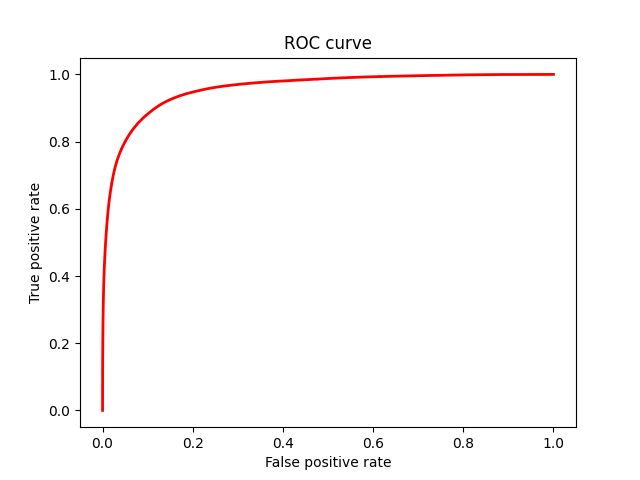
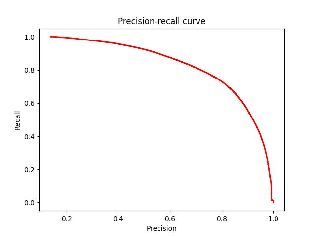

# Facade segmentation and windows counting
This repo is pet project in computer vision and semantic segmentation. The main aim is design or adaptate CNN to segment windows on different buildings and count them.
I used [CMP Facade Dataset](https://cmp.felk.cvut.cz/~tylecr1/facade/) for this task. Dataset contains 606 images with corresponding masks.

## Installation and default settings
```
cd your_path
git clone https://github.com/DmitriyKras/facade-segmentation.git
cd facade-segmentation
mkdir weights
mkdir weights/checkpoint
```
## Project overview
Config files `prepare_config.json`, `train_config.json` and `evaluate_config.json` contain all important params such as pathes, training settings etc for experiment process. Modify them according to provide information you need. Note: all pathes are relative to project's root folder. `utils` and `models` folders contain py files for training, data preparation and model building. `src` folder contains all files for experiment such as `src/prepare.py`, `src/train.py` and `src/evaluate.py`. `pairs` folder used to store processed train, val and test pairs.
By default weights saved after training and used for evaluation stored in `weights`, weights saved during training stored in `weights/checkpoint`.
Resulting JSON files with training and evaluation results stored in `results/training` and `results/evaluation` respectively, figures with PR and ROC curves stored as PNG in `results/evaluation`.

## Data preparation
CMP Facade dataset has 12 classes with different parts of facade. We are interested in only windows, so `utils/process_masks.py` used to prepare masks for our task. Now all masks contain 255 at windows and 0 at other locations. Processed dataset is available at my Kaggle profile: ... . To generate train, val and test pairs make changes at `prepare_config.json` to provide relative pathes to images and masks folders and destination folder where generated pairs will be stored as JSON files. Then run `src/prepare.py`

## Training 
Make changes to `train_config.json` to provide pathes to train and val pairs and other settings such as batch size, epochs etc.
Then run `src/train.py` to start training process, JSON file with training results will be generated and weights will be saved according to config file.

## Evaluation
Make changes to `eval_config.json` to provide required evaluation information and run `src/evaluate.py`. 
JSON file with evaluation results and figures with ROC and PR curves will be generated according to config file.
Here are examples of figures with ROC and PR curves generated by `evaluate.py` with model trained 20 epochs.




